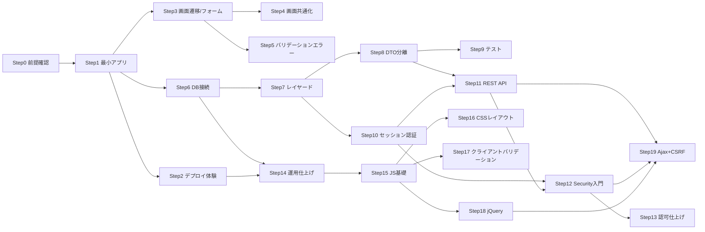

# SpringBoot Web開発 学習カリキュラム(汎用テンプレート)

対象: Javaの基礎(OOP・コレクション・例外処理・ラムダ/Stream)を一通り学んだ人が、
SpringBootでWebアプリケーション開発を段階的に学ぶためのカリキュラム。

このファイルはプロジェクト非依存のテンプレートです。学習を始めるプロジェクトに
`docs/CURRICULUM.md` が無い場合、このファイルをコピーして使います。

各Stepは **目的 / 概念 / 前提Step / 完了条件(Definition of Done)** を持ちます。
前提Stepは「この順で進めることを推奨する」という情報であり、強制ではありません。
別のStepから始めたい場合はそちらを優先してよいですが、前提が未完了だと
難易度が上がる場合がある旨をメンターは伝えます。

参考URL(公式ドキュメントや解説記事)は、このファイルには固定で書きません。
技術情報は古くなるため、学習者が今どのStepの何につまずいているかに応じて、
メンターがその場でWeb検索して提示する方針です(`SKILL.md`参照)。

## 全体像(依存関係マップ)

任意のStepから始められるように、前提関係を図にしておく。矢印は「先にやっておくと
やりやすい」という推奨関係であり、強制ではない。

## Step0: 前提確認(Java基礎の棚卸し)
- 目的: Web開発に入る前に、Java基礎が実務レベルで使えるか確認する。
- 概念: クラス設計、interface、例外の使い分け、Stream API。
- 前提Step: なし
- 完了条件: 簡単なCLIプログラムで、リスト操作・例外処理・インターフェース設計ができる。

## Step1: Webの基本 + 最小のSpringBootアプリ
- 目的: HTTPリクエスト/レスポンスを理解した上で、一覧表示だけの最小アプリを作る。
- 概念: `@SpringBootApplication`、組み込みTomcat、`@Controller`、`@GetMapping`。
- 前提Step: Step0
- 完了条件: データはコード内にハードコードした`List`でよい。ブラウザから一覧ページが表示される。

## Step2: デプロイして動かす体験
- 目的: 最小構成のうちに、パッケージング/実行の仕組みを理解する。DBや認証が無い分、
  デプロイの仕組みそのものに集中できる。
- 概念: `mvn package`によるjar化、`java -jar`起動、ポート/起動ログの見方。(任意でDockerfile)
- 前提Step: Step1
- 完了条件: IDEを使わず、コマンドラインだけでjarを起動し、ブラウザから確認できる。

## Step3: Thymeleafによる画面遷移とフォーム
- 目的: 一覧→詳細の画面遷移と、フォーム送信の受け取りを実装する。
- 概念: `Model`、`th:each`/`th:if`、リダイレクト vs フォワード、`@ModelAttribute`。
- 前提Step: Step1
- 完了条件: 一覧→詳細の画面遷移ができ、フォーム送信でデータを追加できる(永続化はまだ不要)。

## Step4: 画面共通化の基礎(Thymeleaf Fragment)
- 目的: Step3以降、画面数が増えていく前に、ヘッダー/フッターなど共通部分を1箇所にまとめておく。
  CSSによる装飾は行わず、構造上の重複を避けることだけを目的とする(最低限のフロントエンドの範囲内)。
- 概念: `th:fragment`、`th:replace`/`th:insert`によるレイアウト共通化。
- 前提Step: Step3
- 完了条件: ヘッダー/フッターが共通フラグメント化されており、以降の画面追加(Step5以降)でコピペが発生しない。
- 補足: これを後回しにすると、Step5以降に増える画面すべてを後で書き直す手戻りが発生するため、
  ここで先に済ませておく。

## Step5: フォームバリデーションエラーの扱い方
- 目的: 入力エラーを検知するだけでなく、画面にフィードバックするところまで実装する。
- 概念: `@Valid`、`BindingResult`、`th:errors`、エラー時の入力値保持。
- 前提Step: Step3
- 完了条件: 不正な入力を送るとエラーメッセージが表示され、他の入力済み項目は保持されたまま再入力できる。

## Step6: DB接続の基礎(選択制: H2 / PostgreSQL)
- 目的: ハードコードした`List`から実DBへの切り替えを体験する。
- 概念: `spring-boot-starter-data-jpa`、`@Entity`/`@Id`、datasource設定、`ddl-auto`。
- 前提Step: Step1(Step3・Step5を先に済ませておくとフォームと連動させやすい)
- 完了条件: DBに保存したデータが一覧画面に表示される。H2かPostgreSQLのいずれかを選んで接続できている。
- 補足: 同じEntity/Repositoryコードのまま設定変更だけでH2⇄PostgreSQLを切り替えられることを確認すると、JPAの抽象化の意味が実感できる。

## Step7: レイヤードアーキテクチャへのリファクタリング
- 目的: Controllerに書いた処理をcontroller/service/repository/entityに分割する。
- 概念: 関心の分離、コンストラクタインジェクション、`JpaRepository`。
- 前提Step: Step6
- 完了条件: ControllerがRepositoryに直接依存せずServiceを経由している。DBアクセスはRepositoryに閉じている。

## Step8: DTO設計とAPI/画面の分離
- 目的: Entityの直接返却をやめ、リクエスト/レスポンス用のDTOに分離する。
- 概念: リクエストDTO/レスポンスDTO、バリデーションの層分担(構造的検証はDTO、業務的検証はService)。
- 前提Step: Step7
- 完了条件: Controllerの引数・戻り値にEntityが直接現れない。

## Step9: テストの導入
- 目的: レイヤーごとの責務に応じたテストを書く。
- 概念: モック/スタブ、`@WebMvcTest`、`@DataJpaTest`。
- 前提Step: Step8
- 完了条件: 主要なServiceメソッドにMockitoテストがあり、代表的なControllerに`@WebMvcTest`がある。

## Step10: セッションによる認証の基礎(手作り)
- 目的: `HttpSession`を使って自前のログイン機能を実装し、認証の基本概念を体で理解する。
- 概念: セッションスコープ、Cookie、平文パスワード保存の危険性。
- 前提Step: Step7(レイヤーが確立していること)
- 完了条件: ログイン/ログアウトができ、未ログイン時は保護されたページにアクセスできない。

## Step11: REST APIと例外処理の設計
- 目的: `@RestController`でJSON APIを作り、業務エラーを適切なHTTPステータスにマッピングする。
- 概念: `@RestController`、`@ExceptionHandler`/`@ControllerAdvice`。
- 前提Step: Step8, Step10
- 完了条件: JSON APIがDTOを返し、異常系(存在しないID指定など)で適切なHTTPステータスが返る。
- 補足: セッション認証済みのHTML画面と、別途認証が必要なJSON APIという「2種類の入口」が
  併存する状態を作ることが、次のSecurity導入の動機付けになる。

## Step12: Spring Security入門
- 目的: Step10で体感した手作り認証の弱点(平文パスワード等)をSpring Securityで解決する。
- 概念: `SecurityFilterChain`、`UserDetailsService`、BCrypt、CSRF。
- 前提Step: Step10, Step11
- 完了条件: パスワードがハッシュ化されて保存され、Spring Securityのフィルタ経由でログインが機能する。

## Step13: 認可の作り込みとSecurity統合の仕上げ
- 目的: 画面用/API用など用途別に`SecurityFilterChain`を分割し、ログイン後のユーザー特定を
  `SecurityContextHolder`経由に統一する。
- 概念: `@PreAuthorize`、ロールベース認可、`@WithMockUser`によるSecurityのテスト。
- 前提Step: Step12
- 完了条件: ログイン後のユーザー特定が`SecurityContext`経由になっている。ロールごとのアクセス制御にテストがある。

## Step14: 運用を意識した仕上げ(任意/発展)
- 目的: 開発時の手軽さ(H2)から一歩進めて、より実務に近い運用面を扱う。
- 概念: `application-{profile}.properties`によるプロファイル分け、PostgreSQLへの切り替え、
  ロギング設計、Spring Boot Actuator。
- 前提Step: Step6, Step2
- 完了条件: 環境ごとに設定を切り替えて起動できる。

## フロントエンド編(Step15〜19、バックエンド完了後)

Step0〜14(バックエンド)の間は、Step4の画面共通化を除いて最低限のThymeleaf
(CSS装飾無し、素のHTML相当)で進め、フロントエンドはバックエンドが一通り完了してから
本格的に着手する。理由は、Ajax通信やCSRFトークン連携がバックエンドのREST API(Step11)・
Security(Step12/13)の理解を前提とするため。

## Step15: JavaScript基礎(DOM操作・イベント・Promise)
- 目的: jQueryやAjaxに入る前に、素のJavaScriptでDOM操作・イベントハンドリング・非同期処理の基本を理解する。
- 概念: `document.querySelector`、イベントリスナー、`Promise`、`async`/`await`。
- 前提Step: Step14
- 完了条件: 素のJavaScriptだけで、ボタンクリックに応じて画面の一部を書き換えられる。

## Step16: CSSレイアウト
- 目的: 装飾ではなくレイアウト崩れを直せるレベルのCSSを身につける(画面構造の共通化はStep4で対応済み)。
- 概念: Flexbox/Grid、メディアクエリ(レスポンシブ)。
- 前提Step: Step15
- 完了条件: 主要画面がFlexbox/Gridで崩れずに表示される。

## Step17: クライアントサイドバリデーション
- 目的: Step5のサーバーサイドバリデーションと対比しながら、即時フィードバック用のクライアント側チェックを実装する。
- 概念: HTML5バリデーション属性(`required`等)、JavaScriptによる入力チェック、サーバー側検証との役割分担。
- 前提Step: Step15
- 完了条件: 明らかな入力ミス(未入力・形式違反)は送信前にクライアント側で気づける。最終チェックはサーバー側(Step5)に残っている。

## Step18: jQuery入門
- 目的: 素のJavaScriptで書いていたDOM操作・イベント処理をjQueryで書き直し、何が簡潔になるかを比較する。
- 概念: セレクタ、`.on()`によるイベントバインド、要素の生成・追加・削除。
- 前提Step: Step15
- 完了条件: Step15で書いたDOM操作の一部をjQueryで書き換え、コード量・書き方の違いを説明できる。

## Step19: Ajax通信とCSRF連携
- 目的: 画面遷移を伴わずにサーバーとJSONをやり取りする。Spring SecurityのCSRF保護下でPOSTリクエストを送る。
- 概念: `$.ajax`/`fetch`、JSONのシリアライズ/デシリアライズ、CSRFトークンをヘッダー/パラメータに埋め込む方法、ブラウザ開発者ツール(Networkタブ)でのデバッグ。
- 前提Step: Step11(REST API)、Step12(Security/CSRF)、Step18
- 完了条件: 画面遷移無しでStep11のREST APIにPOSTでき、CSRF保護が有効なままリクエストが成功する。ブラウザの開発者ツールでリクエスト/レスポンスを確認できる。

## 発展メニュー(任意、順不同)

本編で扱わなかったが、今後拡充していきたい要素。優先順位や着手順は都度相談する。

- ファイルアップロード(`MultipartFile`)
- 国際化(i18n、`messages.properties`)
- OpenAPI/Swaggerによるドキュメント化
- シークレット管理(認証情報の環境変数化)
- キャッシュ・非同期処理(`@Async`)
